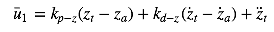

# The C++ Project Readme #

This is the readme for the C++ project.

## Body Rate Control

Implemented in `QuadControl::BodyRateControl(V3F pqrCmd, V3F pqr)`.

Formula:

## Roll Pitch Control

Implemented  in `QuadControl::RollPitchControl(V3F accelCmd, Quaternion<float> attitude, float collThrustCmd)`.

Formula:

## Altitude Control

Implemented in `QuadControl::AltitudeControl(float posZCmd, float velZCmd, float posZ, float velZ, Quaternion<float> attitude, float accelZCmd, float dt)`.

Formula:

## Lateral Position Control

Implemented in `QuadControl::LateralPositionControl(V3F posCmd, V3F velCmd, V3F pos, V3F vel, V3F accelCmdFF)`.

Formula:

## Yaw Control

Implemented in `QuadControl::YawControl(float yawCmd, float yaw)`.

Formula:

## Motor Command Generation

Implemented in `QuadControl::GenerateMotorCommands(float collThrustCmd, V3F momentCmd)`.

Formula:

